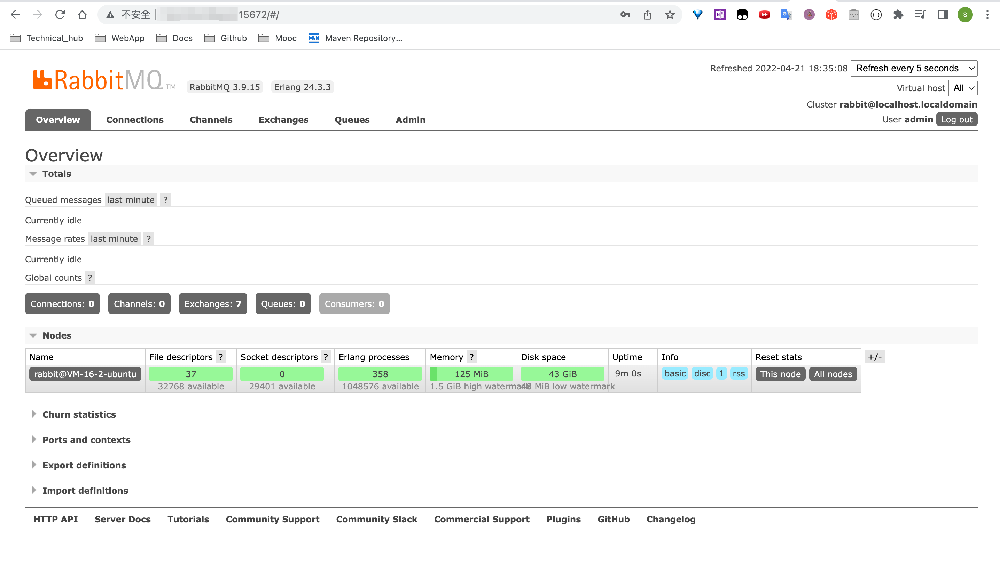

<!-- START doctoc generated TOC please keep comment here to allow auto update -->
<!-- DON'T EDIT THIS SECTION, INSTEAD RE-RUN doctoc TO UPDATE -->
**Table of Contents**  *generated with [DocToc](https://github.com/thlorenz/doctoc)*

- [MQ的相关概念](#mq%E7%9A%84%E7%9B%B8%E5%85%B3%E6%A6%82%E5%BF%B5)
  - [什么是MQ](#%E4%BB%80%E4%B9%88%E6%98%AFmq)
  - [MQ的作用](#mq%E7%9A%84%E4%BD%9C%E7%94%A8)
    - [流量消峰](#%E6%B5%81%E9%87%8F%E6%B6%88%E5%B3%B0)
    - [应用解耦](#%E5%BA%94%E7%94%A8%E8%A7%A3%E8%80%A6)
    - [异步处理](#%E5%BC%82%E6%AD%A5%E5%A4%84%E7%90%86)
  - [MQ的分类](#mq%E7%9A%84%E5%88%86%E7%B1%BB)
  - [MQ的选择](#mq%E7%9A%84%E9%80%89%E6%8B%A9)
- [RabbitMQ](#rabbitmq)
  - [RabbitMQ的概念](#rabbitmq%E7%9A%84%E6%A6%82%E5%BF%B5)
  - [四大核心概念](#%E5%9B%9B%E5%A4%A7%E6%A0%B8%E5%BF%83%E6%A6%82%E5%BF%B5)
    - [生产者](#%E7%94%9F%E4%BA%A7%E8%80%85)
    - [交换机](#%E4%BA%A4%E6%8D%A2%E6%9C%BA)
    - [队列](#%E9%98%9F%E5%88%97)
    - [消费者](#%E6%B6%88%E8%B4%B9%E8%80%85)
  - [RabbitMQ核心部分](#rabbitmq%E6%A0%B8%E5%BF%83%E9%83%A8%E5%88%86)
  - [安装](#%E5%AE%89%E8%A3%85)
    - [相关命令](#%E7%9B%B8%E5%85%B3%E5%91%BD%E4%BB%A4)

<!-- END doctoc generated TOC please keep comment here to allow auto update -->

[//]: # (1. 入门)

[//]: # (2. 核心部分)

[//]: # (3. 高级部分)

[//]: # (4. 集群部分)


# MQ的相关概念

## 什么是MQ

字面意思，消息队列，符合FIFO，这是一种跨进程的通信机制，用于上下游传递消息。

使用了MQ之后，消息发送上游只需要依赖MQ，不需要依赖其他服务了。

## MQ的作用

### 流量消峰

某个系统相同时间内支持10000人进行访问，此时超过10000人会引起服务器宕机等生产事故，那么这个时候，就需要引入MQ来进行流量消峰了。

原理大致是在用户访问系统服务器的中间过程，使用MQ来做缓冲。

结果：用户原本可能会访问不到系统，引入MQ之后，能保证系统的访问

### 应用解耦

企业级项目中，常常有各个系统间的调用。有时候下游系统的调用出现问题，可能就造成了bug。

所以我们需要引入MQ来进行应用的解耦，当下游系统出现问题时，下游系统本应该要处理的进程被缓存在消息队列中，等待下游系统恢复正常之后，下游系统可以继续处理该进程，这样提升了系统的可用性。

### 异步处理

解决异步处理过程中一个服务等待另外一个服务完成任务的问题

## MQ的分类

- ActiveMQ
- Kafka
- RocketMQ
- RabbitMQ

## MQ的选择

1. Kafka

   主要特点是基于Pull的模式来处理消息消费，追求高吞吐量，适合产生大量数据的互联网服务的数据收集业务。如果有日志采集功能，首选Kafka
2. RocketMQ

   阿里背景，为金融互联网领域而生。稳定性更值得信赖。业务场景在阿里双十一经历了考验
3. RabbitMQ

   性能好，社区活跃度比较高。管理界面使用方便，功能也比较完备。

# RabbitMQ

## RabbitMQ的概念

负责接收，存储和转发消息数据

## 四大核心概念

### 生产者

产生数据发送消息的程序是生产者

### 交换机

- 接收来自生产者的消息
- 将消息推送到队列

交换机的类型决定了它如何处理接收到的信息，比如是将消息推送到特定队列还是推送到多个队列，或者是把消息丢弃

### 队列

本质上是一个大的消息缓冲区

**许多生产者可以将消息发送到一个队列**

**许多消费者可以尝试从一个队列接收数据**

### 消费者

消费者大多时候是一个等待接收消息的程序

同一个应用程序既可以是生产者也可以是消费者

## RabbitMQ核心部分

1. Hello World----简单模式
2. Work queues----工作模式
3. Publish/Subscribe----发布订阅模式
4. Routing----路由模式
5. Topics----主题模式
6. Publisher Confirms----发布确认模式

## 安装

[官方文档中关于下载的shell脚本](https://www.rabbitmq.com/install-debian.html)

```shell
#!/usr/bin/sh

sudo apt-get install curl gnupg apt-transport-https -y

## Team RabbitMQ's main signing key
curl -1sLf "https://keys.openpgp.org/vks/v1/by-fingerprint/0A9AF2115F4687BD29803A206B73A36E6026DFCA" | sudo gpg --dearmor | sudo tee /usr/share/keyrings/com.rabbitmq.team.gpg > /dev/null
## Launchpad PPA that provides modern Erlang releases
curl -1sLf "https://keyserver.ubuntu.com/pks/lookup?op=get&search=0xf77f1eda57ebb1cc" | sudo gpg --dearmor | sudo tee /usr/share/keyrings/net.launchpad.ppa.rabbitmq.erlang.gpg > /dev/null
## PackageCloud RabbitMQ repository
curl -1sLf "https://packagecloud.io/rabbitmq/rabbitmq-server/gpgkey" | sudo gpg --dearmor | sudo tee /usr/share/keyrings/io.packagecloud.rabbitmq.gpg > /dev/null

## Add apt repositories maintained by Team RabbitMQ
sudo tee /etc/apt/sources.list.d/rabbitmq.list <<EOF
## Provides modern Erlang/OTP releases
##
## "bionic" as distribution name should work for any reasonably recent Ubuntu or Debian release.
## See the release to distribution mapping table in RabbitMQ doc guides to learn more.
deb [signed-by=/usr/share/keyrings/net.launchpad.ppa.rabbitmq.erlang.gpg] http://ppa.launchpad.net/rabbitmq/rabbitmq-erlang/ubuntu bionic main
deb-src [signed-by=/usr/share/keyrings/net.launchpad.ppa.rabbitmq.erlang.gpg] http://ppa.launchpad.net/rabbitmq/rabbitmq-erlang/ubuntu bionic main

## Provides RabbitMQ
##
## "bionic" as distribution name should work for any reasonably recent Ubuntu or Debian release.
## See the release to distribution mapping table in RabbitMQ doc guides to learn more.
deb [signed-by=/usr/share/keyrings/io.packagecloud.rabbitmq.gpg] https://packagecloud.io/rabbitmq/rabbitmq-server/ubuntu/ bionic main
deb-src [signed-by=/usr/share/keyrings/io.packagecloud.rabbitmq.gpg] https://packagecloud.io/rabbitmq/rabbitmq-server/ubuntu/ bionic main
EOF

## Update package indices
sudo apt-get update -y

## Install Erlang packages
sudo apt-get install -y erlang-base \
                        erlang-asn1 erlang-crypto erlang-eldap erlang-ftp erlang-inets \
                        erlang-mnesia erlang-os-mon erlang-parsetools erlang-public-key \
                        erlang-runtime-tools erlang-snmp erlang-ssl \
                        erlang-syntax-tools erlang-tftp erlang-tools erlang-xmerl

## Install rabbitmq-server and its dependencies
sudo apt-get install rabbitmq-server -y --fix-missing
```

### 相关命令

```shell
  sudo systemctl start rabbitmq-server
  sudo systemctl status rabbitmq-server
  sudo systemctl stop rabbitmq-server
  sudo apt-get update
  sudo apt-get install sysv-rc-conf
  sudo sysv-rc-conf
  sudo sysv-rc-conf rabbitmq-server on
  sysv-rc-conf -list
  rabbitmq-plugins version
  sudo rabbitmq-plugins enable rabbitmq_management
  sudo rabbitmqctl add_user admin password
  sudo rabbitmqctl set_user_tags admin administrator
  sudo rabbitmqctl set_permissions -p / admin ".*" ".*" ".*"
  sudo rabbitmqctl list_users
```

port：15672 开启防火墙
