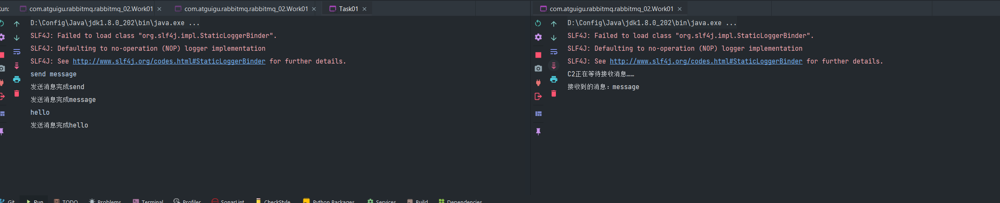

<!-- START doctoc generated TOC please keep comment here to allow auto update -->
<!-- DON'T EDIT THIS SECTION, INSTEAD RE-RUN doctoc TO UPDATE -->
**Table of Contents**  *generated with [DocToc](https://github.com/thlorenz/doctoc)*

- [Hello World----简单模式](#hello-world----%E7%AE%80%E5%8D%95%E6%A8%A1%E5%BC%8F)
  - [依赖](#%E4%BE%9D%E8%B5%96)
  - [消息生产者](#%E6%B6%88%E6%81%AF%E7%94%9F%E4%BA%A7%E8%80%85)
  - [消息的消费者](#%E6%B6%88%E6%81%AF%E7%9A%84%E6%B6%88%E8%B4%B9%E8%80%85)
- [Work queues----工作队列，任务队列](#work-queues----%E5%B7%A5%E4%BD%9C%E9%98%9F%E5%88%97%E4%BB%BB%E5%8A%A1%E9%98%9F%E5%88%97)
  - [抽取工具类](#%E6%8A%BD%E5%8F%96%E5%B7%A5%E5%85%B7%E7%B1%BB)
  - [工作线程代码](#%E5%B7%A5%E4%BD%9C%E7%BA%BF%E7%A8%8B%E4%BB%A3%E7%A0%81)
  - [生产者代码](#%E7%94%9F%E4%BA%A7%E8%80%85%E4%BB%A3%E7%A0%81)
  - [消息应答](#%E6%B6%88%E6%81%AF%E5%BA%94%E7%AD%94)
    - [自动应答](#%E8%87%AA%E5%8A%A8%E5%BA%94%E7%AD%94)
    - [消息应答的方法](#%E6%B6%88%E6%81%AF%E5%BA%94%E7%AD%94%E7%9A%84%E6%96%B9%E6%B3%95)
    - [Multiple的使用](#multiple%E7%9A%84%E4%BD%BF%E7%94%A8)
  - [消息重新入队](#%E6%B6%88%E6%81%AF%E9%87%8D%E6%96%B0%E5%85%A5%E9%98%9F)
- [Publish/Subscribe----发布订阅模式](#publishsubscribe----%E5%8F%91%E5%B8%83%E8%AE%A2%E9%98%85%E6%A8%A1%E5%BC%8F)
- [Routing----路由模式](#routing----%E8%B7%AF%E7%94%B1%E6%A8%A1%E5%BC%8F)
- [Topics----主题模式](#topics----%E4%B8%BB%E9%A2%98%E6%A8%A1%E5%BC%8F)
- [Publisher Confirms----发布确认模式](#publisher-confirms----%E5%8F%91%E5%B8%83%E7%A1%AE%E8%AE%A4%E6%A8%A1%E5%BC%8F)

<!-- END doctoc generated TOC please keep comment here to allow auto update -->

## Hello World----简单模式

### 依赖

```xml
<?xml version="1.0" encoding="UTF-8"?>
<project xmlns="http://maven.apache.org/POM/4.0.0"
         xmlns:xsi="http://www.w3.org/2001/XMLSchema-instance"
         xsi:schemaLocation="http://maven.apache.org/POM/4.0.0 http://maven.apache.org/xsd/maven-4.0.0.xsd">
    <modelVersion>4.0.0</modelVersion>

    <groupId>org.biu</groupId>
    <artifactId>rabbitmq-hello</artifactId>
    <version>1.0-SNAPSHOT</version>
    <build>
        <plugins>
            <plugin>
                <groupId>org.apache.maven.plugins</groupId>
                <artifactId>maven-compiler-plugin</artifactId>
                <configuration>
                    <source>8</source>
                    <target>8</target>
                </configuration>
            </plugin>
        </plugins>
    </build>

    <dependencies>
        <dependency>
            <groupId>com.rabbitmq</groupId>
            <artifactId>amqp-client</artifactId>
            <version>5.14.2</version>
        </dependency>

        <dependency>
            <groupId>commons-io</groupId>
            <artifactId>commons-io</artifactId>
            <version>2.11.0</version>
        </dependency>
    </dependencies>

</project>
```

### 消息生产者

```java
package com.atguigu.rabbiitmq.one;

import com.rabbitmq.client.Channel;
import com.rabbitmq.client.Connection;
import com.rabbitmq.client.ConnectionFactory;

/**
 * @Author longbiu
 * @Class_name Producer
 * @Description 生产者发消息
 * @Date 2022/4/22 01:53
 **/
public class Producer {
    public static final String QUEUE_NAME = "hello";

    public static void main(String[] args) throws Exception {
        //  创建一个连接工厂
        ConnectionFactory factory = new ConnectionFactory();
        factory.setHost("ip_address");
        // AMQP的端口是5672，需要处理一下防火墙
        factory.setPort(5672);
        factory.setUsername("admin");
        factory.setPassword("password");
        // 启动报错释放,连接超时的问题
        factory.setHandshakeTimeout(60000);

        try (
                Connection connection = factory.newConnection();
                Channel channel = connection.createChannel()) {
            /**
             *  生成一个队列
             *  1. 队列名称
             *  2. 队列中的消息是否持久化，默认把消息存储在内存中
             *  3. 该队列是否只供一个消费者进行消费，是否进行共享
             *  4. 是否自动删除
             *  5. 其他参数
             */
            channel.queueDeclare(QUEUE_NAME, false, false, false, null);
            String message = "hello world";
            /**
             * 发送一个消息
             * 1. 发送至哪个交换机
             * 2. 路由的key
             * 3. 其他的参数消息
             * 4. 发送消息的消息体
             */
            channel.basicPublish("", QUEUE_NAME, null, message.getBytes());
            System.out.println(" 消息发送完毕");
        }
    }
}
```

### 消息的消费者

 ```java
package com.atguigu.rabbiitmq.one;

import com.rabbitmq.client.*;

import java.io.IOException;
import java.util.concurrent.TimeoutException;

/**
 * @Class_name Consumer
 * @Description 消费者接收消息
 * @Author longbiu
 * @Date 2022/4/22 11:46
 **/
public class Consumer {
    public static final String QUEUE_NAME = "hello";

    public static void main(String[] args) throws Exception {
        ConnectionFactory factory = new ConnectionFactory();
        factory.setHost("ip_address");
        // AMQP的端口是5672，需要处理一下防火墙
        factory.setPort(5672);
        factory.setUsername("admin");
        factory.setPassword("password");
        // 启动报错释放,连接超时的问题
        factory.setHandshakeTimeout(60000);

        Connection connection = factory.newConnection();
        Channel channel = connection.createChannel();
        System.out.println(" 等待接收消息……");

        // 推送的消息如何进行消费的接口回调
        DeliverCallback deliverCallback = (consumerTag, deliivery) -> {
            String message = new String(deliivery.getBody());
            System.out.println(message);
        };

        // 取消费的一个回调接口，比如消费的时候，队列被删除了
        CancelCallback cancelCallback = (consumerTag) -> {
            System.out.println("消息消费被中断");
        };

        /**
         * 消费者消费消息
         * 1. 消费哪个队列
         * 2. 消费成功后，是否要自动应答
         * 3. 消费未成功后的回调
         */
        channel.basicConsume(QUEUE_NAME, true, deliverCallback, cancelCallback);
    }
}

 ```

## Work queues----工作队列，任务队列

主要思想是避免立即执行资源密集型任务。

把任务封装为消息，并将其发送到队列。

一个消息只能被处理一次，不可以处理多次

### 抽取工具类

```java
package com.atguigu.rabbitmq.rabbitmq_02.utils;

import com.rabbitmq.client.Channel;
import com.rabbitmq.client.Connection;
import com.rabbitmq.client.ConnectionFactory;

/**
 * @Class_name RabbitMqUtils
 * @Description 工具类
 * @Author longbiu
 * @Date 2022/4/22 14:09
 **/
public class RabbitMqUtils {
    public static Channel getChannel() throws Exception {
        //  创建一个连接工厂
        ConnectionFactory factory = new ConnectionFactory();
        factory.setHost("ip_address");
        // AMQP的端口是5672，需要处理一下防火墙
        factory.setPort(5672);
        factory.setUsername("admin");
        factory.setPassword("password");
        // 启动报错释放,连接超时的问题
        factory.setHandshakeTimeout(60000);
        Connection connection = factory.newConnection();
        Channel channel = connection.createChannel();
        return channel;
    }
}
```

### 工作线程代码

```java
package com.atguigu.rabbitmq.rabbitmq_02;

import com.atguigu.rabbitmq.rabbitmq_02.utils.RabbitMqUtils;
import com.rabbitmq.client.CancelCallback;
import com.rabbitmq.client.Channel;
import com.rabbitmq.client.DeliverCallback;

/**
 * @Class_name Work01
 * @Description 工作线程
 * @Author longbiu
 * @Date 2022/4/22 14:25
 **/
public class Work01 {
    // 队列名称
    public static final String QUEUE_NAME = "hello";

    public static void main(String[] args) throws Exception {
        Channel channel = RabbitMqUtils.getChannel();
        DeliverCallback deliverCallback = (consumerTag, message) -> {
            System.out.println("接收到的消息：" + new String(message.getBody()));
        };

        CancelCallback cancelCallback = (consumerTag) -> {
            System.out.println(consumerTag + "消息被消费者取消消费接口回调逻辑");
        };
        // 消息的接收
        System.out.println("C3正在等待接收消息……");
        channel.basicConsume(QUEUE_NAME, true, deliverCallback, cancelCallback);
    }
}
```

### 生产者代码

```java
package com.atguigu.rabbitmq.rabbitmq_02;

import com.atguigu.rabbitmq.rabbitmq_02.utils.RabbitMqUtils;
import com.rabbitmq.client.Channel;

import java.util.Scanner;

/**
 * @Class_name Task01
 * @Description 生产者，启动一个发送线程
 * @Author longbiu
 * @Date 2022/4/22 19:01
 **/
public class Task01 {
    public static final String QUEUE_NAME = "hello";

    public static void main(String[] args) throws Exception {
        Channel channel = RabbitMqUtils.getChannel();
        channel.queueDeclare(QUEUE_NAME, false, false, false, null);
        Scanner scanner = new Scanner(System.in);
        while (scanner.hasNext()) {
            String message = scanner.next();
            channel.basicPublish("", QUEUE_NAME, null, message.getBytes());
            System.out.println("发送消息完成" + message);
        }
    }
}
```



### 消息应答

为了保证消息在发送过程中不丢失，rabbitmq引入消息应答机制

消费者在收到消息并且处理该消息之后，告诉rabbitmq，它已经处理了，rabbitmq可以把该消息删除了。

#### 自动应答

没有对传递的消息进行限制，可能会使得消费者接收过多的，来不及处理的消息，导致消息积压，使得内存耗尽，最终，这些消费者线程被操作系统杀死。

所以，自动应答模式不太靠谱，它需要消费者能高效稳定的消费。

#### 消息应答的方法

- Channel.basicAck ---- 用于肯定确认，rabbitmq已经知道该消息成功处理，可以丢弃
- Channel.basicNack ---- 用于否定确认
- Channel.basicReject ---- 用于拒绝，直接丢弃该消息

#### Multiple的使用

```java
channel.basicAck(deliveryTag,true);
```

channel上的，该消息之前入队但还没处理的消息，都会被确认收到消息应答（true）

**可以减少网络拥堵，减少网络流量**

### 消息重新入队

第一个消费者突然中断，此时消息自动去空闲的消费者那里消费，**达到了消息不丢失的目的**。

## Publish/Subscribe----发布订阅模式

## Routing----路由模式

## Topics----主题模式

## Publisher Confirms----发布确认模式